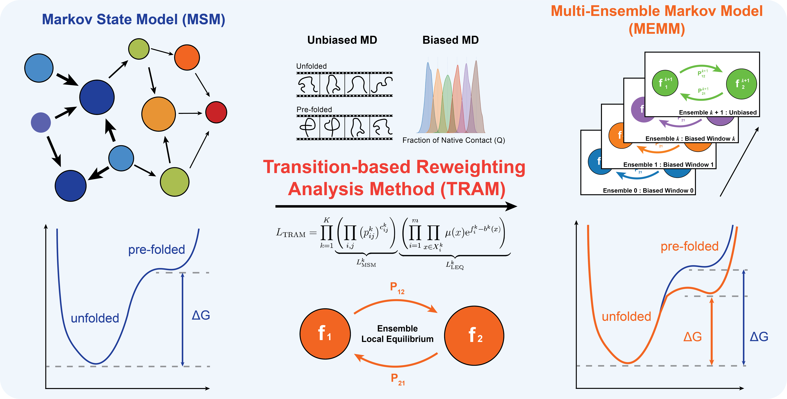
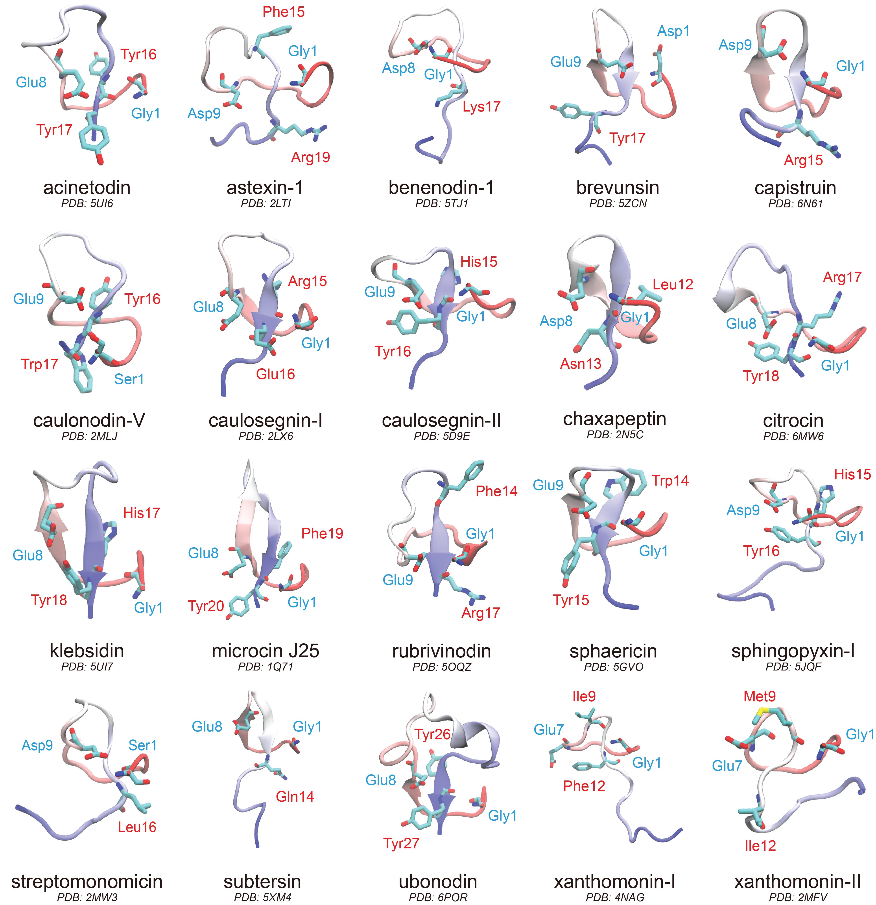

# How Lasso Peptides Fold

  

  <a href="./Figures/SongYin_AICHE_2025_Lasso.pdf">Poster</a> | <a href="">Paper</a> | <a href="">Data Repository</a> | <a href="">Code Repository</a>

## Table of Contents
- [Abstract](#abstract)
- [MD Simulations](#md-simulations)
  - [Systems](#systems)
  - [Unbiased Simulations](#unbiased-simulations)
  - [Biased Simulations](#biased-simulations)
- [Markov State Model (MSM)](#markov-state-model-msm)
- [Transition-based Reweighting Analysis Method (TRAM)](#transition-based-reweighting-analysis-method-tram)
- [Thermodynamic Analysis](#thermodynamic-analysis)
- [Kinetic Analysis](#kinetic-analysis)
- [Engineering](#engineering)
- [License](#license)

## Abstract

This study combined extensive unbiased and biased MD simulations with advanced statistical model (TRAM) and deep learning framework (LPC-VAE) to systematically investigate the ability to form native pre-folded conformation in solution and the universal folding mechanisms of 20 structurally characterized lasso peptides.

## MD Simulations

### Systems

We studied 20 structurally characterized lasso peptides.

  

### Unbiased Simulations

Unbiased MD simulations were performed starting from the pre-folded structure and fully extended structure of all 20 lasso peptides. For each lasso peptide, we conducted ~200 µs unbiased MD simulations using OpenMM on the distributed computing platform Folding@home. 

### Biased Simulations

Biased MD simulations, Umbrella Sampling, were performed using the Fraction of Native Contacts (Q) as the reaction coordinate. All frames from the unbiased simulations were discretized into 50 evenly distributed bins where Q ranged from 0 (completely unfolded) to 1 (pre-folded), and each bin was an independent umbrella sampling window. For each umbrella sampling window, we applied a harmonic potential based on the root-mean-square deviation (RMSD) of heavy atoms relative to their reference structure.

**Sample Code:** [`umbrella_sampling.py`](https://github.com/songyingit/lasso_fold/tree/main/MD_data/umbrella_sampling.py)

## Markov State Model (MSM)

Markov State Model (MSM) was first employed to connect multiple short MD simulation trajectories to capture the global information of conformational dynamics:

1. **Featurization:** Pairwise residue-residue distances.

**Sample Code:** [`msm_feature.py`](https://github.com/songyingit/lasso_fold/tree/main/MSM/msm_feature.py)

2. **Dimensionality reduction:** Time-lagged independent component analysis (tICA) to identify slow timescale components.
3. **Clustering:** K-means clustering to discretize into microstates.
4. **Hyperparameter optimization:** tIC dimensions (2-10) and microstate numbers (100-700) optimized by maximizing VAMP-2 score via 10-fold cross-validation

**Sample Code:** [`msm_tica_cluster_hpopt.py`](https://github.com/songyingit/lasso_fold/tree/main/MSM/msm_tica_cluster_hpopt.py)

## Transition-based Reweighting Analysis Method (TRAM)

The kinetic asymmetry of folding for most of lasso peptides (unfolding proceeds much more rapidly than folding) poses fundamental challenge for the principle of detailed balance of MSM. To overcome these limitations, we implemented the Transition-based Reweighting Analysis Method (TRAM), a statistically optimal framework which leverages biased simulations to populate rarely visited states and estimating the thermodynamics and kinetics with reweighting estimators. 

The implementation of TRAM consisted of the following steps:

1. **Featurization:** Pairwise residue-residue distances.

**Sample Code:** [`tram_feature.py`](https://github.com/songyingit/lasso_fold/tree/main/TRAM/tram_feature.py)

2. **Bias energy calculation:** Compute bias potential energy for all frames relative to all umbrella windows
3. **Thermodynamic state assignment (ttrajs):** Map frames to umbrella windows or unbiased ensemble. In total, there would be 'bias sampling windows' + 1 ensemble.  
4. **Conformational state discretization (dtrajs):** Apply tICA separately to biased/unbiased data, combine features, and cluster with k-means on TICA-transformed features to obtain dtraj.
5. **TRAM implementation:** Construct multi-ensemble Markov model (MEMM) using pyEMMA.

**Sample Code:** [`tram_implement.py`](https://github.com/songyingit/lasso_fold/tree/main/TRAM/tram_implement.py)

6. **Hyperparameter optimization:** Lag time for each system was optimized for TRAM analysis. 

**Sample Code:** [`tram_lagtime_opt.py`](https://github.com/songyingit/lasso_fold/tree/main/TRAM/tram_lagtime_opt.py)

## Thermodynamic Analysis

**Folding free energy:** Calculated from TRAM stationary distributions. Pre-folded state: Q ≥ 0.8 and ring closure ≤ 7 Å; Unfolded state: Q ≤ 0.1 and ring closure ≥ 7 Å. Uncertainty estimated via bootstrap resampling (200 iterations).

**Sample Code:** [`folding_free_energy.py`](https://github.com/songyingit/lasso_fold/tree/main/Analysis/folding_free_energy.py)

**Loop Q relaxation time:** Quantifies loop stability by monitoring loop native contacts evolution from MEMM dynamics.

**Sample Code:** [`loop_q_relax_time.py`](https://github.com/songyingit/lasso_fold/tree/main/Analysis/loop_q_relax_time.py)

**Entropy cost:** Calculated using [PARENT program](https://github.com/markusfleck/PARENT) with maximum information spanning tree (MIST) algorithm on 10,000 random frames from both Pre-folded state and Unfolded state.

**Sample Code:** [`entropy_cost.py`](https://github.com/songyingit/lasso_fold/tree/main/Analysis/entropy_cost.py)

## Kinetic Analysis

**Pathway clustering:** Leveraged Variational AutoEncoder (VAE) based Latent-Space Path Clustering (LPC) identifies folding pathway channels and find the most representative pathway with maximum flux:

1. **Pathway identification:** TPT generates ~10,000 pathways (unfolded: Q ≤ 0.1; folded: Q ≥ 0.8)
2. **Pathway embedding:** Project each pathway onto three 2D tIC subspaces, discretize into 50×50 bins, concatenate into 7500-dimensional vectors
3. **VAE training:** Train variational autoencoder to map pathways to 2D latent space (100 epochs)
4. **Pathway clustering:** K-means clustering in latent space to identify metastable path channels, optimized by silhouette analysis

**Sample Code:** [`entropy_cost.py`]()

## Engineering

## License

**© 2025 Song Yin. All Rights Reserved.**

This code is made available for viewing purposes only. No permission is granted to use, copy, modify, or distribute this code for any purpose.